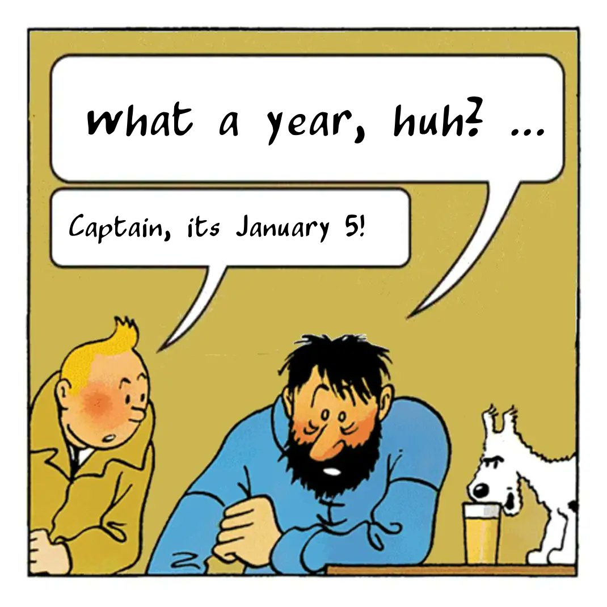

# What a Year huh? Tintin and Captain Haddock meme

This code generates a "What a Year huh? ..." Tintin and Captain Haddock meme and sends it to Mastodon.


The generated meme is inspired by the following:

- https://mastodon.lol/@codefiscal/109630875913117948
- https://sigmoid.social/@whataweekhuh@hostux.social
- https://twitter.com/tintinades/status/1610305758146560003?s=20&t=-UIljrxbnLRR-_JPtNJlxg


To use this code, you will need to create a `.env` file in the root directory with the following information:

```bash
MASTODON_ACCESS_TOKEN=<your Mastodon access token>
```

You will also need to have the following dependencies installed:

- mastodon
- dotenv
- PIL

Install them using this command:
```bash
pip install -r requirements.txt`
```

To generate and send the meme, run the following command:
```bash
python main.py
```